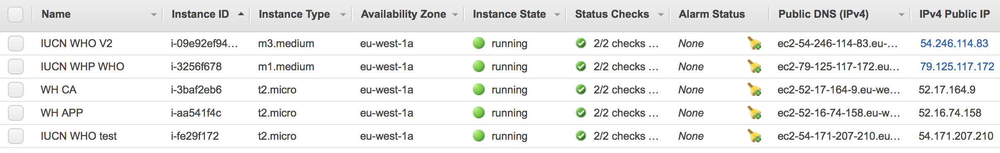

# History

I built the first prototype of the Outlook assessment module in Python (Web2Py framework), as proof of concept. The underlying principle is to store the results of assessment in a database so that it could be managed and analysed more easily and effectively. A database approach is the only way to systematically manage the data the project generates.

For the development, RSMI was commissioned to undertake the design, implementation and maintenance of the three modules: assessment, site information, and front-end website for showcasing findings. In hindsight, it was an unrealistic ambition with impossible funds, but at the time the can-do spirit prevailed and I was technically in-mature and inexperienced as to make do with developing everything, rather than reality check and focusing on the minimally viable product.

In hindsight, part of the reason was that the roles were never clear, I think I was given the role of project management, yet I had no power in making design choices nor allocate funds. My role became an inefficient intermediate - I led numerous consultations with the team during every milestone, and had constant struggles to accommodate opinions and then feed to the developers. The decision making process was unnecessarily long and painful. The team was tired and so was I. 

Despite the hiccups along the way, a product was developed with all three modules, albeit late. The database played a major role to fulfilling the requirement of data analysis. I built the pipelines from database dumps to queries that output assessments, and then turn into usable formats. These powered the first outlook report.

My role in the second development is a technical advisory one and not involved in the daily management of the development.

# Technical architecture

The assessment module is written in Java, a custom-made system that accepts assessments via the web and store in a PostgreSQL database. The user facing front end website displays results of assessment and was implemented in Liferay, which during the second development changed to a Drupal based system (written in PHP).

At the moment, there is a disconnection between the two systems: assessment and display. The assessment module and the old website is on one Amazon EC2 instance (instance name: 'IUCN WHP WHO') and the new, updated website resides another (instance name: 'IUCN WHO V2'). The new website used a database dump to migrate content from the old system. By design, the pipeline built by EDW does not reverse the flow of data in the other direction.

The source codes can be found on [GitHub](https://github.com/iucn-whp)

# Administration

As mentioned previously, the assessment module and the front facing website displaying results of assessment are hosted by Amazon (Amazon Web Services, AWS), and the servers are known as EC2 instances or servers. The old and new websites are of the type 'medium' (used to describe the capacity of the server or instance), physically in the 'eu-west-1a' region (in Ireland). Additionally, there is a 'micro' instance for the developers called 'IUCN WHO test', who used it for testing. It was decided that this 'micro instance' will be kept for future use.



The two additional 'micro' instances are used for hosting 1) the prototype of the World Heritage comparative analysis , 'WH CA' (seed funded by UNESCO WHC) and 2) some products on the World Heritage Analyses, 'WH APP'. 

In order to assess these instances (use SSH), you will need 'private keys'. The keys are located at (WCMC-PC-01918)

- [E:\Yichuan\Yichuan\amazon_putty_ssh](E:\Yichuan\Yichuan\amazon_putty_ssh)

The keys may be revoked in the [AWS management console](https://aws.amazon.com). The login credentials are:

- Yichuan.shi@iucn.org
- *(see my last email)*

You may copy and send 'keys' to developers so that they have access to the servers, however, I would highly recommend **not** giving external people access to our Amazon AWS account.

The management of the instances are beyond the scope of this documentation, however, the below are the most commonly used features:

- create new instances
- the IP address of the instance (address for access)
- the private keys (key for access)
- the ports that need to be open (TCP22 for SSH, and TCP80 and 443 for HTTP/S)

# Database dump

One of the key function of the system(s) is to enable the extraction and analysis of information for the World Heritage Outlook report. For that purpose, it is important to obtain a copy of the dataset in the live database behind the website (but **never** work on the live database itself!). This is called a database dump.

For security reasons, you will need to SSH tunnel to the instance where the database is located and forward the remote port to local. There is a saved session called `WHO_backend` that contains necessary connection information and also forwards the remote 5432 port (the database port) to the local 5433 port. 


Once you've successfully logged using that saved session, open PgAdmin, the database management tool to connect to your local port 5433, which now points to the remote machine via SSH tunnel. 


You may now select the database from which you'd like to make a dump. Use the 'backup' button (see red arrow) to create a file which holds the content of the database.


On your local machine, create an empty new database and then 'restore' (see the blue arrow) to create an identical copy of the remote database. 

This concludes the database dump or 'extraction of data'.

# Convert to Access database

The data in the database dump is a replica of the database serving the website. Unfortunately the data is not stored in a format that allows us to gain useful insight, as bits of information scatter throughout numerous tables. You may refer to the diagram for additional information

- [E:\Yichuan\IT\ER_diagram_130802](E:\Yichuan\IT\ER_diagram_130802)

For the most commonly used queries, I have built a re-usable Microsoft Access database that connects to the PostgreSQL database. This allows also to export to more familiar excel spreadsheet people find easy to work with.

- [E:\Yichuan\Elena\WHOA_171027](E:\Yichuan\Elena\WHOA_171027)


**!IMPORTANT!** 

There is one manual step that needs to be performed to assist the analysis before updating the links. 

We need to differentiate the most recent assessment ids, and separate them for the two assessment cycles. This is essential to pull out the correct versions of the assessment for analysis. This step can be done in Access but would be much easier in the PostgreSQL database. In your newly restored database, create a view called 'z_wdpa_latest' using the below:

```sql
-- View: z_wdpaid_latest
-- DROP VIEW z_wdpaid_latest;

CREATE OR REPLACE VIEW z_wdpaid_latest AS 
 WITH a AS (
         SELECT whp_whp_sites.wdpa_id, whp_site_assessment_versions.assessment_id, whp_site_assessment_versions.assessment_version_id, whp_whp_sites.name_en, whp_site_assessment.assessment_cycle, whp_site_assessment_versions.version_code, max(whp_site_assessment_versions.version_code) OVER (PARTITION BY whp_site_assessment_versions.assessment_id) AS max_code
           FROM whp_site_assessment, whp_site_assessment_versions, whp_whp_sites
          WHERE whp_site_assessment.assessment_id = whp_site_assessment_versions.assessment_id AND whp_whp_sites.site_id = whp_site_assessment.site_id AND whp_site_assessment.assessment_cycle::text = '2014'::text
        ), b AS (
         SELECT whp_whp_sites.wdpa_id, whp_site_assessment_versions.assessment_id, whp_site_assessment_versions.assessment_version_id, whp_whp_sites.name_en, whp_site_assessment.assessment_cycle, whp_site_assessment_versions.version_code, max(whp_site_assessment_versions.version_code) OVER (PARTITION BY whp_site_assessment_versions.assessment_id) AS max_code
           FROM whp_site_assessment, whp_site_assessment_versions, whp_whp_sites
          WHERE whp_site_assessment.assessment_id = whp_site_assessment_versions.assessment_id AND whp_whp_sites.site_id = whp_site_assessment.site_id AND whp_site_assessment.assessment_cycle::text = '2017'::text
        ), combined AS (
                 SELECT a.wdpa_id, a.assessment_cycle, a.assessment_version_id
                   FROM a
                  WHERE a.version_code = a.max_code
        UNION 
                 SELECT b.wdpa_id, b.assessment_cycle, b.assessment_version_id
                   FROM b
                  WHERE b.version_code = b.max_code
        )
 SELECT combined.wdpa_id, combined.assessment_cycle, max(combined.assessment_version_id) AS assessment_version_id
   FROM combined
  GROUP BY combined.wdpa_id, combined.assessment_cycle
  ORDER BY combined.wdpa_id, combined.assessment_cycle;

ALTER TABLE z_wdpaid_latest
  OWNER TO postgres;
```

The rationale is to identify the largest value of `assessment_version_code` for each cycle and for each `assessment_id`, on the basis that the latest/newly created id should be naturally larger. By finding this code, it is guaranteed that the latest versions are used, irrespective of the version number and stage, which may be wrong.

Once the above is done, you can now update the links in the MS Access database, using the 'Linked Table Manager' so that they point to the most recent local database as a source


Make sure you tick 'Always prompt for new location', so that you update links for all tables in one go


Create a new data source, here you'll need to specify the details of the newly 'restored' database


# Analysis

The analysis is fully documented below:

- [Analysis of World Heritage Outlook assessment](http://nbviewer.jupyter.org/github/Yichuans/world-heritage-outlook-analysis/blob/master/analysis.ipynb)


